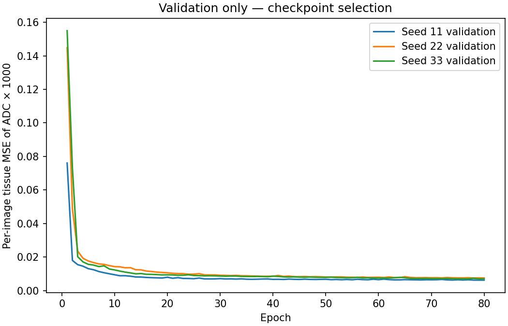
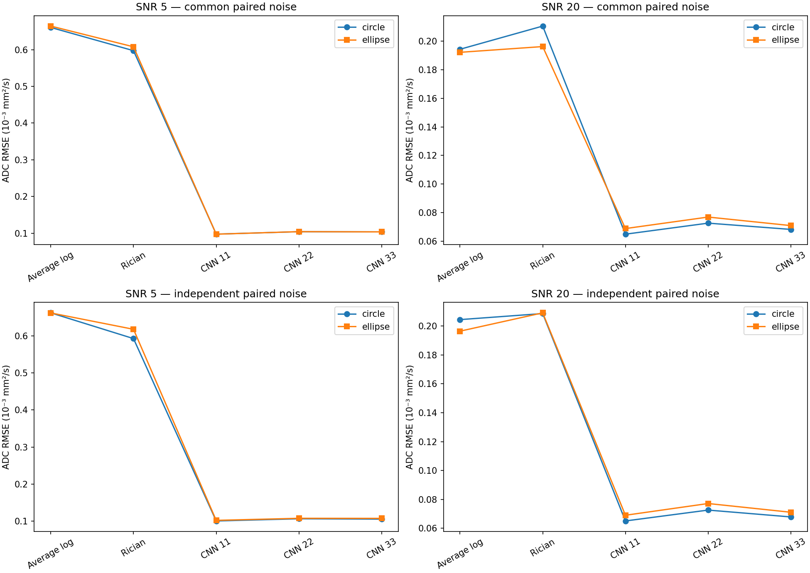
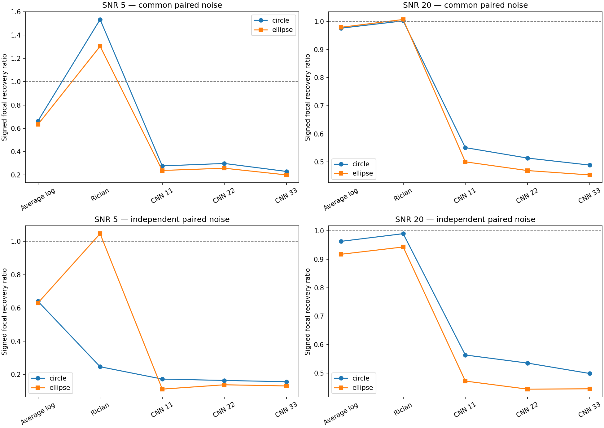
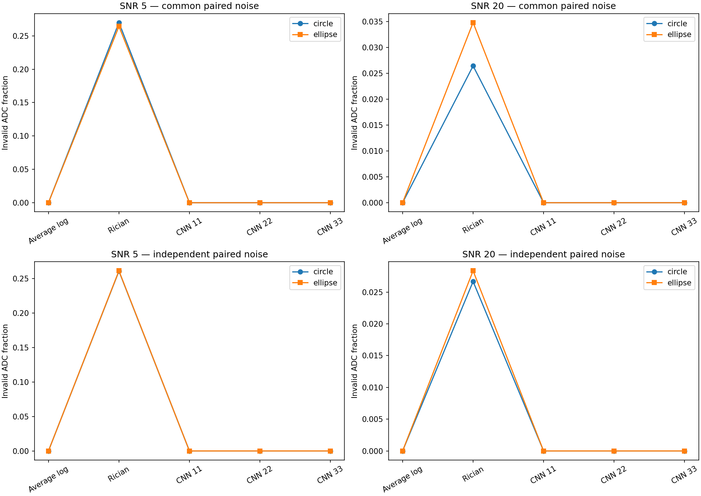

# First small CNN: measured results

The first CNN was trained and evaluated on 2026-10-02. All three optimization seeds substantially reduced tissue ADC RMSE, but also suppressed known focal changes. This is a successful training milestone and a quantitative-fidelity warning: this model's lower whole-tissue error does not establish better preservation of a small abnormality.

This report describes the prespecified [method](FIRST_CNN_METHOD.md) and [configuration](../configs/first_cnn.json). The earlier [conventional pilot](PILOT_RESULTS.md) remains a separate experiment.

## What was trained, and how

We generated original two-tissue numerical phantoms, generated diffusion signals at b=0/1000 s/mm², averaged signals spatially to the acquisition grid, and added Gaussian real/imaginary noise before forming magnitudes. The supervised target was ADC fitted from noiseless acquisition-resolution signals. Assigned ADC was not blurred to make the target.

The network takes two observed magnitude-average images, each using four repetitions: eight total acquisitions. Both channels are normalized by the observed mean-b0 image's 95th percentile. Inference receives no truth, evaluation mask, focal location, generator noise scale or paired healthy reference.

The architecture is two 3×3 convolution/ReLU stages (2→16→16 channels), a 1×1 convolution (16→1), then Softplus scaled to ADC units. It has **2,641 trainable parameters**, a 5×5 spatial context, and no pooling. Adam used learning rate 0.001, batch size 64 and 80 epochs. Loss was per-image tissue MSE after scaling ADC by 1,000, with images weighted equally. NumPy/SciPy supplied simulation, reference fitting and conventional estimators; PyTorch supplied optimization/inference; Matplotlib supplied diagnostic plots; pytest checked numerical and data-boundary behavior.

The 144 new geometry IDs were split before generating variants: **64 training / 16 validation / 32 reserved calibration / 32 final test**. There were 4,096 training and 512 validation images. Calibration groups were unused. Training/validation contained circular foci only; equal-nominal-area ellipses were registered as unfamiliar final-test shapes before training. All derivatives stayed in their geometry's split. Each seed's minimum-validation-loss checkpoint was frozen and reloaded before final testing; no final-test result selected a seed, epoch, loss or architecture.

Final evaluation contained **1,024 paired acquisitions × five methods = 5,120 method-case rows**, representing **32 independent test geometry groups**. Averaging/log fitting, known-sigma Rician MLE and each CNN used identical observations. Two SNRs, two focal sizes, both contrast signs, two shapes and common/independent noise pairing were evaluated. The Rician comparator alone received the known simulated noise scale.

## Training outcome

| Optimization seed | Initial validation MSE | Selected epoch | Selected validation MSE | Training seconds |
| --- | ---: | ---: | ---: | ---: |
| 11 | 0.411946 | 79 | 0.006217 | 32.19 |
| 22 | 0.753531 | 80 | 0.007483 | 32.69 |
| 33 | 0.635843 | 79 | 0.006962 | 33.40 |

MSE here uses ADC scaled by 1,000, rather than raw mm²/s. Initial values are measured before optimization; selected values are the minimum over all 80 recorded epochs. All three histories and saved checkpoints are retained. No seed is designated the final-test winner.



Execution used CPU, two threads and deterministic PyTorch operations on an Apple M3 Pro. The environment was Python 3.13.7, PyTorch 2.14.1, NumPy 2.4.3, SciPy 1.17.1 and Matplotlib 3.10.9. Training/data preparation took **99.66 seconds**; the complete training, conventional/CNN evaluation and reporting run took **161.51 seconds**. These are timings of this small numerical experiment, not scanner-time savings.

## Familiar circles: lower ADC error, weaker focal recovery

The following compact summaries use common healthy/perturbed complex noise. This pairing isolates sensitivity to the inserted change; it is not a measured longitudinal experiment. Each row requests 128 paired cases: 32 test geometries × two radii × two signed contrasts.

| SNR | Method | Tissue RMSE (10⁻³ mm²/s) | Signed focal recovery | Invalid tissue ADC (%) | Defined focal pairs |
| ---: | --- | ---: | ---: | ---: | ---: |
| 5 | Averaging + log fit | 0.660 | 0.663 | 0.0 | 128/128 |
| 5 | Known-sigma Rician MLE | 0.597 | 1.534 | 27.0 | 65/128 |
| 5 | CNN seed 11 | 0.098 | 0.278 | 0.0 | 128/128 |
| 5 | CNN seed 22 | 0.104 | 0.298 | 0.0 | 128/128 |
| 5 | CNN seed 33 | 0.104 | 0.230 | 0.0 | 128/128 |
| 20 | Averaging + log fit | 0.194 | 0.976 | 0.0 | 128/128 |
| 20 | Known-sigma Rician MLE | 0.210 | 1.002 | 2.6 | 128/128 |
| 20 | CNN seed 11 | 0.065 | 0.551 | 0.0 | 128/128 |
| 20 | CNN seed 22 | 0.073 | 0.514 | 0.0 | 128/128 |
| 20 | CNN seed 33 | 0.068 | 0.489 | 0.0 | 128/128 |

Recovery is `delta_estimate / delta_reference`, using paired focal-ROI means and the acquisition-resolution reference change. A ratio of one preserves the change; a positive ratio below one attenuates it. It is not a detection sensitivity or the percentage of lesions found. Both ADC increases and decreases are included as signed ratios, rather than averaging their raw changes together.

At SNR5 mean signed focal recovery was only **23–30%** for the CNNs; at SNR20 it was **49–55%**. Averaging recovered approximately 66% and 98%, respectively. These are means of per-case recovery ratios, not ratios of pooled changes. All CNNs lowered tissue RMSE, so the two endpoints lead to different judgments about this estimator.

Size/sign stratification supports the same finding. For 0.5 mm circles at SNR20, recovery ranged from **0.332 to 0.427** across the three seeds and both contrast signs, versus approximately 0.976–0.977 for averaging. For 1.5 mm circles it ranged from 0.498 to 0.771. At SNR5, CNN recovery ranged from 0.186–0.253 for small circles and 0.244–0.358 for large circles. Attenuation affected both contrast signs.

## Unfamiliar shape and independent-noise sensitivity

| Pairing | Shape | SNR | Averaging recovery | CNN recovery range across seeds | Rician recovery (defined pairs) |
| --- | --- | ---: | ---: | ---: | ---: |
| Common | Ellipse | 5 | 0.633 | 0.200–0.258 | 1.304 (73/128) |
| Common | Ellipse | 20 | 0.979 | 0.454–0.500 | 1.007 (128/128) |
| Independent | Circle | 5 | 0.640 | 0.156–0.172 | 0.246 (50/128) |
| Independent | Circle | 20 | 0.963 | 0.499–0.563 | 0.990 (128/128) |
| Independent | Ellipse | 5 | 0.630 | 0.112–0.138 | 1.047 (64/128) |
| Independent | Ellipse | 20 | 0.917 | 0.444–0.472 | 0.943 (128/128) |

Ranges describe optimization-seed sensitivity, not confidence intervals. Averaging/CNN recovery uses all 128 pairs and all 32 geometries in every row. Rician recovery at independent-noise SNR5/circle uses only 29 of 32 geometries with any defined focal pair; all other displayed Rician compact groups have at least one defined pair in all 32 geometries. Missing focal pairs still remain in the requested denominator.

The CNNs also had lower tissue RMSE on ellipses and with independent noise; those full results remain in the CSVs and figure below. Ellipses were unfamiliar shapes, but still came from the same restricted geometric simulator. Independent pairing uses separately drawn healthy/perturbed noise and provides a noisier sensitivity analysis; one noise draw per final-test condition cannot characterize its distribution precisely.





Spatial spillover is also visible. With common noise, CNN nonfocal paired-change RMSE was approximately **7.2×10⁻⁶ to 1.9×10⁻⁵ mm²/s** across shapes/SNRs/seeds. Voxelwise conventional comparators had exactly zero on their finite nonfocal outputs under this coupling. With independent noise, the CNNs reduced nonfocal change noise, but did not recover the missing focal amplitude.

## Denominators and interpretation

Tissue RMSE is calculated over finite perturbed ADC estimates within the true tissue footprint, then averaged within geometry and across geometries. The compact tables first average radius/sign conditions within each geometry for each metric, excluding undefined metric values, then weight contributing geometries equally. Thus this is a mean of case RMSEs, not a pooled voxel RMSE. Invalid fractions and defined-pair/group counts must accompany it. Rician RMSE is conditional on different surviving voxels, and its focal recovery is conditional on surviving paired ROIs; these numbers do not give an unconditional accuracy ranking. The unrounded, size/sign-specific summaries preserve each denominator.

The CNN's Softplus produces finite positive ADC predictions in this run. That output constraint is not an identification test, an uncertainty estimate or calibrated confidence. Rician invalids expose unbounded/unidentified ADC optima instead of replacing them with finite prior-driven values.



Learning a spatial prior and minimizing whole-tissue MSE are plausible explanations for the attenuation, but this experiment does not establish its mechanism. The fixed central focus, two-tissue values and limited geometry family permit strong priors. This result concerns this small CNN in this simulator; it does not establish that every CNN or clinical denoiser suppresses abnormalities.

There is no uncertainty calibration, adaptive stopping, repetition reduction, patient/anatomical-resource validation or clinical claim. Three optimization seeds are not three independent cohorts. The summaries are descriptive; no cohort confidence interval or rare-failure guarantee is claimed.

The next scientific step is to prespecify richer training/validation variants and a comparison that tests focal preservation, including a compatible published denoiser. Any revised method needs new final-test groups because this test set has now been inspected. Calibration/stopping remains a separate milestone and cannot be inferred from these finite predictions.

## Artifacts, provenance and verification

The local run is `outputs/first-cnn/`. It contains exact config/splits/environment, `training_examples.csv`, `training_history.csv`, three checkpoints, `cases.csv`, `anatomy_summary.csv`, `summary.csv`, `example.npz` and four diagnostic plots. Checkpoints/arrays/raw outputs remain ignored by Git; only reviewed original numerical-summary figures accompany this report.

Frozen training source commit: `b6ef3a0f7ca9ab766478fe703fe068def666bf96` (clean working tree). Saved configuration SHA-256: `4b629a62fe7287a1a5cf6f7ed365884fc9293762cc814002bd1294c129e03cdf`.

| Checkpoint | SHA-256 |
| --- | --- |
| `checkpoint_seed11.pt` | `85675fd4c70117c410128be759c31aef5957afab8950a37a4467ffb206e7b3c8` |
| `checkpoint_seed22.pt` | `91024f7dbecf2360edb830884f8f0c88ebc71312a9e18c8ea61b636ffa3861be` |
| `checkpoint_seed33.pt` | `41f7d8f2677d46a5181a00837a9846d518fde81e925e9d1432161e8e6e0811e7` |

All 223 source tests and all 223 isolated installed-wheel tests passed. The installed CLI separately trained/reloaded a two-epoch smoke model. Independent scientific/code reviews covered grouping, input/target restrictions, validation selection, matched acquisitions and failure policies. A separate result audit verified source/config/checkpoint hashes, all 80-epoch selections, raw→geometry→cohort arithmetic, signed-change identities and saved example-map RMSE. These checks establish implementation consistency, not anatomical realism.

Reproduce with the environment recipe in [FIRST_CNN_METHOD.md](FIRST_CNN_METHOD.md), then run:

```sh
python -m adc_fidelity_bench train-cnn --config configs/first_cnn.json --output outputs/first-cnn-reproduction
```

Use a fresh output directory. The exact learning dependency lock is scoped to the tested Python 3.13/macOS ARM64 CPU environment; cross-platform runs should record their resolved versions and may differ numerically.
