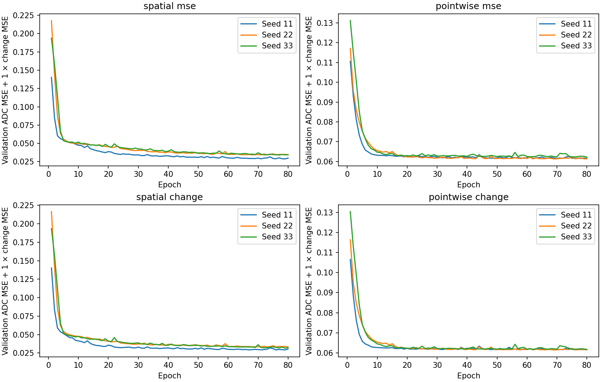
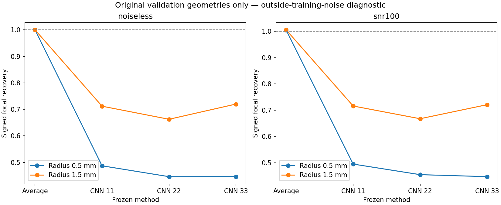
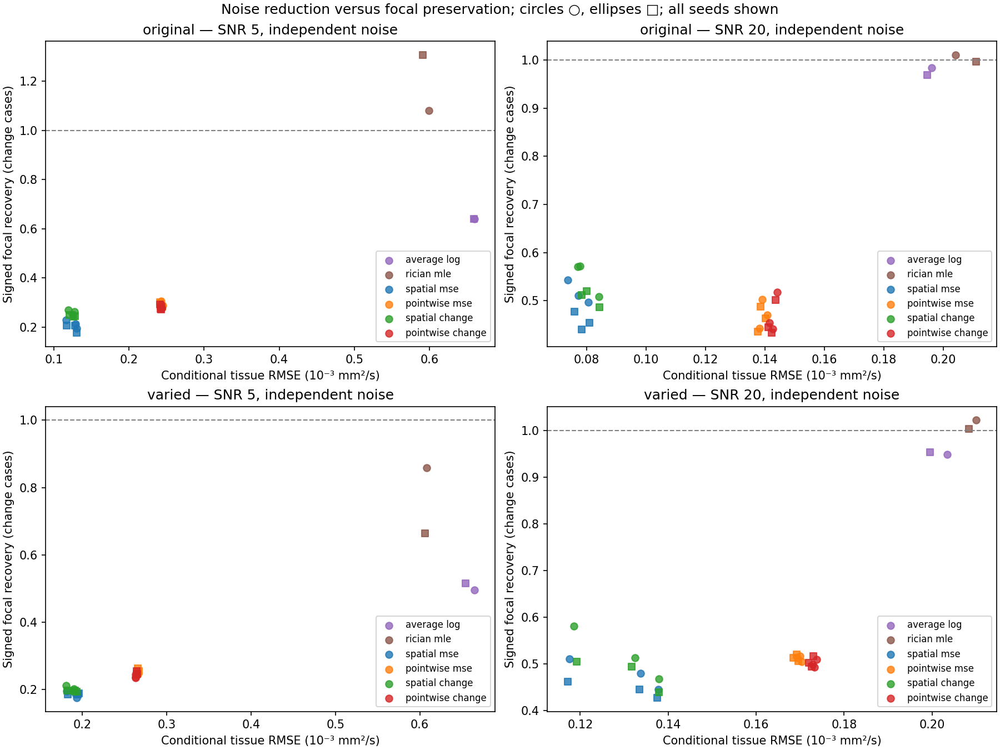
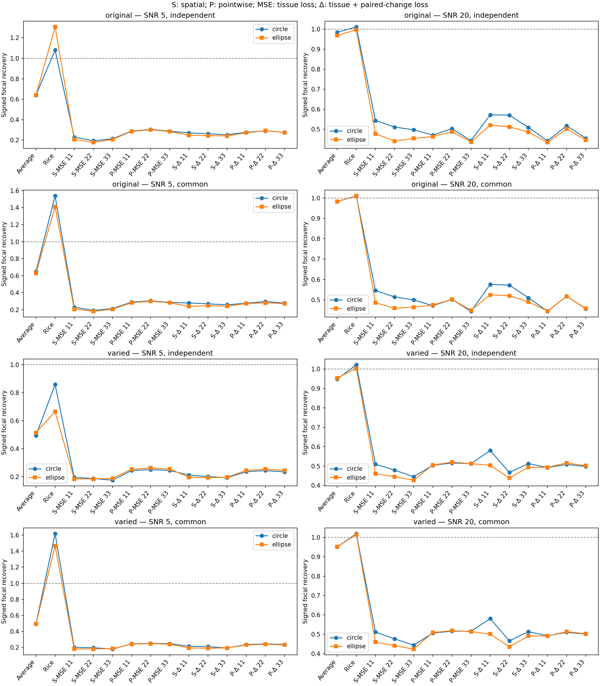
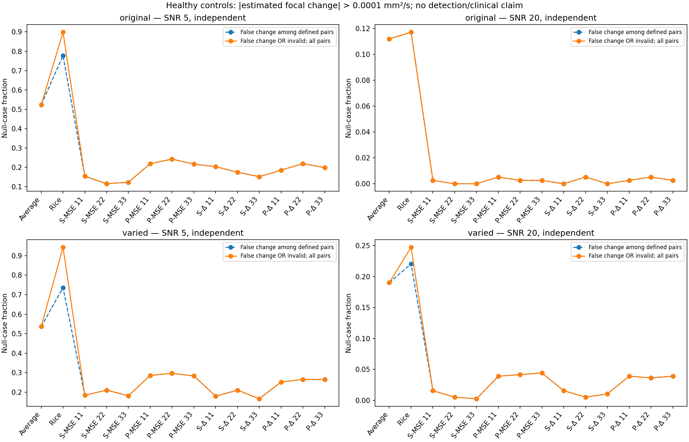
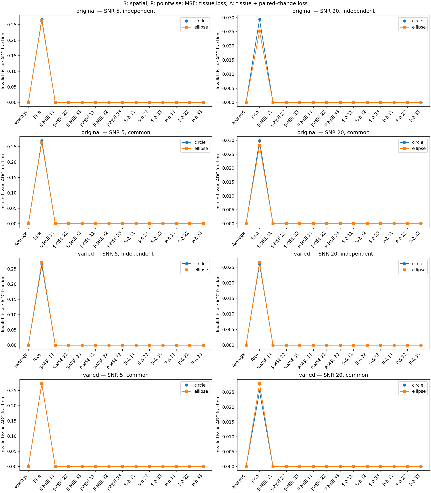

# Focal preservation: measured four-cell results

The controlled follow-up was trained and evaluated on 2026-10-02. Removing learned spatial mixing improved mean focal recovery at low SNR, but increased tissue ADC error and null alarms. Adding the paired-change loss gave modest, condition-dependent gains to the spatial model; it did not resolve attenuation, and did not improve the pointwise model consistently. All four cells still substantially suppressed known changes. These results characterize a quantitative trade-off; estimator trustworthiness remains unestablished.

This report follows the [frozen method](FOCAL_PRESERVATION_METHOD.md), [configuration](../configs/focal_ablation.json) and [implementation plan](plans/2026-10-02-focal-preservation.md). The [first CNN](FIRST_CNN_RESULTS.md) remains a separate, preserved experiment.

## What we did and how

We crossed two architectures with two training objectives: the original spatial CNN (2,641 parameters, two 3×3 hidden convolutions) and a similarly sized pointwise CNN (2,647 parameters, all 1×1 convolutions), trained with tissue ADC MSE alone or tissue MSE plus paired focal-change MSE. Three optimization seeds per cell produced **12 validation-selected checkpoints**. Every cell used the same data, per-seed shuffle and composite validation-selection score. No test result selected a seed, epoch, architecture or loss weight.

The new numerical cohort contains 144 fresh geometry groups, split **64 train / 16 validation / 32 reserved calibration / 32 final test** before derivatives. We varied synthetic tissue ADC/S0 and valid focal locations, included both signed contrasts and zero-change pairs, and trained on circles only. There were **2,560 training pairs and 640 validation pairs**, containing 5,120 and 1,280 images respectively. Calibration acquisitions and scores remained unused. Contrast variants deliberately share a noise draw within each condition and remain clustered within geometry.

NumPy generated fine-resolution parameters and monoexponential diffusion signals. Signals were averaged spatially to the acquisition grid before complex Gaussian noise and magnitude formation. The target was ADC fitted to noiseless acquisition-resolution signals. Each model received only two observed magnitude-mean images, four repetitions per b-value at b=0/1000 s/mm²: **eight total acquisitions**. Observed b0-percentile normalization was shared by all cells. PyTorch supplied Adam optimization, restricted checkpoint reload and inference; SciPy supplied conventional estimation; Matplotlib generated the figures; pytest checked numerical contracts and leakage boundaries. True masks and paired targets defined supervised losses/evaluation only, never inference.

After every checkpoint was frozen and reloaded, we evaluated original-like and varied regimes, circles and held-out ellipses, SNR5/20, both radii, four nonzero contrasts plus δ=0, three noise draws and both pairings. Independent healthy/perturbed noise was primary; common noise was a sensitivity control. **15,360 paired acquisitions × 14 methods = 215,040 method-case rows**, representing only **32 independent test geometry groups**. Averaging/log fitting, known-sigma Rician MLE and all CNNs received identical measurements. The Rician comparator alone received generator sigma.

## Training and checkpoint selection

Losses below use ADC scaled by 1,000. Selection is the earliest minimum of validation tissue MSE + 1.0×paired focal-change MSE for every cell, including MSE-only training.

| Cell | Seed | Initial selection score | Selected epoch | Tissue MSE | Change MSE | Selection score |
| --- | ---: | ---: | ---: | ---: | ---: | ---: |
| Spatial MSE | 11 | 0.428392 | 79 | 0.019385 | 0.009420 | 0.028805 |
| Spatial MSE | 22 | 0.771444 | 76 | 0.023726 | 0.010355 | 0.034080 |
| Spatial MSE | 33 | 0.652375 | 77 | 0.023623 | 0.010470 | 0.034093 |
| Pointwise MSE | 11 | 0.419141 | 72 | 0.049529 | 0.012012 | 0.061541 |
| Pointwise MSE | 22 | 0.617480 | 69 | 0.049371 | 0.011925 | 0.061296 |
| Pointwise MSE | 33 | 0.566548 | 80 | 0.049818 | 0.012390 | 0.062208 |
| Spatial + change | 11 | 0.428392 | 79 | 0.020012 | 0.009184 | 0.029196 |
| Spatial + change | 22 | 0.771444 | 80 | 0.023349 | 0.009849 | 0.033198 |
| Spatial + change | 33 | 0.652375 | 79 | 0.021948 | 0.009646 | 0.031594 |
| Pointwise + change | 11 | 0.419141 | 62 | 0.049599 | 0.011901 | 0.061500 |
| Pointwise + change | 22 | 0.617480 | 69 | 0.049598 | 0.011835 | 0.061432 |
| Pointwise + change | 33 | 0.566548 | 80 | 0.049747 | 0.011948 | 0.061695 |

All 80 epochs per checkpoint were recorded, giving 960 history rows. Reloading each selected checkpoint reproduced both validation components exactly. Initial selection scores also matched within architecture/seed, consistent with the shared initialization across objectives.



Execution used CPU, two threads and deterministic operations, with Python 3.13.7, PyTorch 2.14.1, NumPy 2.4.3, SciPy 1.17.1 and Matplotlib 3.10.9 on macOS ARM64. Training/data preparation took **278.51 seconds**; the complete run took **769.95 seconds**. These timings describe this numerical experiment, not scanner-time savings.

## Development diagnosis of the original CNN

Before interpreting the follow-up, we checked the original frozen checkpoints on their **16 original validation groups only**, using noiseless signals and one independent-noise SNR100 draw. The original configuration/checkpoint hashes and all 19 essential non-CLI source hashes matched. There were 512 method-case rows, with no calibration or final-test acquisitions used.

| Diagnostic condition | Averaging recovery | CNN recovery, seeds 11 / 22 / 33 |
| --- | ---: | --- |
| Noiseless | 1.000 | 0.600 / 0.554 / 0.583 |
| Reference SNR100 | 1.005 | 0.606 / 0.561 / 0.584 |

Noiseless averaging matched the reference exactly, with zero RMSE. Noiseless CNN recovery was **0.446–0.487 for small circles** and **0.663–0.720 for large circles**, averaging contrast signs within geometry. Both signs attenuated; all predictions were finite. Noise alone therefore cannot explain suppression on these diagnostic inputs. These noise conditions were outside the original training range, so this does not isolate the effects of training distribution, preprocessing, architecture or objective, and is not a final performance estimate.



## Primary final test: circles under independent noise

Each method/regime/SNR row requests **768 pairs**: 32 geometries × two radii × four signed nonzero contrasts × three noise draws. Noise is averaged within geometry/condition; compact summaries average conditions within geometry before giving contributing geometries equal weight. RMSE is the mean of finite-voxel case RMSEs. Recovery is the mean of signed per-case ratios, using the full focal footprint and acquisition-resolution reference change. One means preserved mean change; it is not detection sensitivity. Null pairs are excluded here.

Ranges describe the three optimization seeds, not confidence intervals. Every CNN and log-fit row has 768 defined focal pairs across all 32 geometries. Rician counts expose conditional recovery over surviving complete paired ROIs; conditional RMSE uses a different surviving voxel set. The endpoints of different columns need not belong to the same seed.

### Varied tissue values and locations

| SNR | Method | Tissue RMSE (10⁻³ mm²/s) | Signed recovery | Absolute change error (10⁻³ mm²/s) | Defined focal pairs / groups |
| ---: | --- | ---: | ---: | ---: | --- |
| 5 | Averaging + log fit | 0.665 | 0.495 | 0.138 | 768/768; 32/32 |
| 5 | Known-sigma Rician MLE | 0.608 | 0.859 | 0.271 | 149/768; 27/32 |
| 5 | Spatial MSE | 0.181–0.193 | 0.176–0.196 | 0.109–0.112 | 768/768; 32/32 |
| 5 | Pointwise MSE | 0.265–0.266 | 0.245–0.252 | 0.113–0.114 | 768/768; 32/32 |
| 5 | Spatial + change | 0.181–0.190 | 0.195–0.212 | 0.106–0.108 | 768/768; 32/32 |
| 5 | Pointwise + change | 0.263 | 0.235–0.244 | 0.112–0.113 | 768/768; 32/32 |
| 20 | Averaging + log fit | 0.204 | 0.948 | 0.058 | 768/768; 32/32 |
| 20 | Known-sigma Rician MLE | 0.210 | 1.022 | 0.064 | 741/768; 32/32 |
| 20 | Spatial MSE | 0.118–0.138 | 0.445–0.510 | 0.062–0.070 | 768/768; 32/32 |
| 20 | Pointwise MSE | 0.169–0.170 | 0.504–0.516 | 0.069–0.070 | 768/768; 32/32 |
| 20 | Spatial + change | 0.119–0.138 | 0.467–0.580 | 0.056–0.066 | 768/768; 32/32 |
| 20 | Pointwise + change | 0.173–0.174 | 0.492–0.508 | 0.069–0.071 | 768/768; 32/32 |

Pointwise MSE recovered **0.245–0.252 at SNR5**, versus **0.176–0.196** for spatial MSE, but tissue RMSE increased from **0.181–0.193 to 0.265–0.266 ×10⁻³ mm²/s**. At SNR20 the architecture effect depended on seed and regime, while spatial models retained lower tissue error. Attenuation persisted without learned neighbour mixing, so such mixing is not necessary for this failure in these inputs; the shared normalization and learned nonlinear mapping remain.

The change loss increased spatial-model mean recovery at varied SNR5 for all three seeds. At varied SNR20, seeds 11 and 33 increased, while seed 22 decreased from 0.479 to 0.467. Pointwise change-loss recovery decreased for every matched seed in this varied-circle comparison at both SNRs. Absolute change error and opposite-sign rates give additional information: at varied SNR5, spatial MSE/+change absolute error was 0.109–0.112/0.106–0.108 ×10⁻³ mm²/s, while opposite-sign rates remained approximately 34–36%/34–35%. At SNR20 their opposite-sign rates were approximately 9–11%/9–10%. Better average amplitude recovery alone does not establish reliable individual change estimation.

Rician invalid tissue fractions were **26.3% at SNR5 and 2.6% at SNR20**. Its apparent near-unit or amplified recovery is conditional on the displayed surviving pairs; at SNR5 only 27 of 32 geometries contributed any defined focal pair. CNN/log predictions were finite throughout tissue, which does not establish identifiability or confidence.

### Original-like tissue values and central foci

| SNR | Method | Tissue RMSE (10⁻³ mm²/s) | Signed recovery | Absolute change error (10⁻³ mm²/s) | Defined focal pairs / groups |
| ---: | --- | ---: | ---: | ---: | --- |
| 5 | Averaging + log fit | 0.660 | 0.641 | 0.147 | 768/768; 32/32 |
| 5 | Known-sigma Rician MLE | 0.599 | 1.080 | 0.290 | 327/768; 32/32 |
| 5 | Spatial MSE | 0.117–0.131 | 0.195–0.229 | 0.094–0.098 | 768/768; 32/32 |
| 5 | Pointwise MSE | 0.243–0.245 | 0.288–0.306 | 0.101–0.102 | 768/768; 32/32 |
| 5 | Spatial + change | 0.119–0.128 | 0.253–0.271 | 0.095–0.098 | 768/768; 32/32 |
| 5 | Pointwise + change | 0.243–0.244 | 0.276–0.292 | 0.101–0.103 | 768/768; 32/32 |
| 20 | Averaging + log fit | 0.196 | 0.984 | 0.047 | 768/768; 32/32 |
| 20 | Known-sigma Rician MLE | 0.204 | 1.010 | 0.048 | 768/768; 32/32 |
| 20 | Spatial MSE | 0.074–0.081 | 0.497–0.544 | 0.047–0.055 | 768/768; 32/32 |
| 20 | Pointwise MSE | 0.138–0.141 | 0.443–0.502 | 0.059–0.063 | 768/768; 32/32 |
| 20 | Spatial + change | 0.077–0.084 | 0.509–0.572 | 0.044–0.051 | 768/768; 32/32 |
| 20 | Pointwise + change | 0.142–0.144 | 0.442–0.517 | 0.058–0.063 | 768/768; 32/32 |

Spatial change-loss recovery increased for all matched seeds in this control, but remained below 0.6 on average. Its stronger SNR5 recovery also came with more null alarms, as shown below. Rician invalid tissue fractions were **26.7%/2.9% at SNR5/20**; all 32 geometries contributed some defined focal pairs. The richer training distribution and common composite selection differ from the historical first CNN. Historical before/after differences cannot isolate either change; the controlled comparison is among these four new cells.



## Size, sign, unfamiliar shape and noise coupling

Attenuation affected both signs and both sizes. For varied circles at SNR20, recovery across the four signed contrasts and all seeds was **0.338–0.407 for small / 0.512–0.672 for large spatial-MSE foci**. Spatial + change gave **0.307–0.454 / 0.574–0.730**. The change loss therefore did not uniformly improve small-focus conditions. Pointwise MSE gave **0.444–0.557 / 0.485–0.535**. These are ranges of geometry-averaged condition means, not individual-case ranges. Averaging gave 0.900–0.981 / 0.934–0.978, with more noise in individual estimates.

| Regime | SNR | Averaging | Spatial MSE | Pointwise MSE | Spatial + change | Pointwise + change |
| --- | ---: | ---: | ---: | ---: | ---: | ---: |
| original | 5 | 0.641 | 0.178–0.207 | 0.284–0.302 | 0.242–0.249 | 0.273–0.293 |
| original | 20 | 0.969 | 0.441–0.478 | 0.436–0.487 | 0.486–0.520 | 0.434–0.502 |
| varied | 5 | 0.515 | 0.185–0.189 | 0.254–0.263 | 0.193–0.198 | 0.246–0.255 |
| varied | 20 | 0.953 | 0.427–0.461 | 0.505–0.520 | 0.439–0.504 | 0.493–0.516 |

The ellipse table uses independent noise and requests 768 change pairs per method/row; all displayed CNN/log recoveries are defined. Ellipses remained attenuated despite being held out from training. Spatial recovery was often weaker than for circles. Shape/size can alter sampled focal position and discrete area, so this comparison does not isolate a pure shape mechanism.

Positive pooled recovery also hides near-zero or reversed condition means. For varied **0.5 mm ellipses at SNR5 with assigned δ=−0.00015 mm²/s**, recovery across seeds was **−0.096 to +0.022 for spatial MSE**, **−0.041 to +0.062 for spatial + change**, **−0.106 to −0.037 for pointwise MSE**, and **−0.106 to −0.065 for pointwise + change**. Each seed/condition used 96 defined pairs across 32 geometries. This registered size/sign/contrast stratum illustrates why aggregate preservation cannot replace local-condition assessment.

Common-noise circle recovery was close to the primary CNN results: varied SNR5 spatial MSE 0.179–0.200, spatial + change 0.194–0.214; varied SNR20 0.444–0.512 and 0.466–0.581. Rician low-SNR recovery changed more strongly under coupling and exclusions: varied SNR5 circles gave 1.618 under common noise (257/768 pairs, 31 contributing geometries), versus 0.859 under independent noise (149/768, 27 geometries). These conditional subsets cannot support an unconditional ranking.



Common-noise nonfocal paired-change RMSE was **5.97×10⁻⁶ to 2.12×10⁻⁵ mm²/s** across spatial cells, regimes, SNRs and seeds, averaging both shapes and nonzero contrasts within geometry. Conventional voxelwise methods were exactly zero on finite outputs, and pointwise CNN values were at numerical-roundoff scale (≤1.87×10⁻¹⁰). Spatial context therefore spread some inserted change outside its true footprint. With independent noise, spatial CNNs reduced nonfocal change noise, but that benefit did not restore focal amplitude.

## Null controls and operational denominators

At δ=0, noiseless paired references are identical. The prespecified alarm is **|estimated focal mean change| >1e-4 mm²/s**. This is a benchmark threshold, not a clinical threshold or calibrated risk guarantee. The following independent-noise table pools **both shapes and radii**, requesting **384 null pairs per method/regime/SNR**. Conditional alarm rates average surviving pairs within geometry/condition; alarm OR invalid charges missing full focal predictions as failures and includes every requested null pair.

| Regime | SNR | Method | Conditional alarms (%) | Alarm OR invalid (%) | Defined null pairs / groups |
| --- | ---: | --- | ---: | ---: | --- |
| original | 5 | Averaging + log fit | 52.3 | 52.3 | 384/384; 32/32 |
| original | 5 | Known-sigma Rician MLE | 77.7 | 89.8 | 170/384; 32/32 |
| original | 5 | Spatial MSE | 11.5–15.4 | 11.5–15.4 | 384/384; 32/32 |
| original | 5 | Pointwise MSE | 21.6–24.2 | 21.6–24.2 | 384/384; 32/32 |
| original | 5 | Spatial + change | 15.1–20.3 | 15.1–20.3 | 384/384; 32/32 |
| original | 5 | Pointwise + change | 18.5–21.9 | 18.5–21.9 | 384/384; 32/32 |
| original | 20 | Averaging + log fit | 11.2 | 11.2 | 384/384; 32/32 |
| original | 20 | Known-sigma Rician MLE | 11.7 | 11.7 | 384/384; 32/32 |
| original | 20 | Spatial MSE | 0.0–0.3 | 0.0–0.3 | 384/384; 32/32 |
| original | 20 | Pointwise MSE | 0.3–0.5 | 0.3–0.5 | 384/384; 32/32 |
| original | 20 | Spatial + change | 0.0–0.5 | 0.0–0.5 | 384/384; 32/32 |
| original | 20 | Pointwise + change | 0.3–0.5 | 0.3–0.5 | 384/384; 32/32 |
| varied | 5 | Averaging + log fit | 53.6 | 53.6 | 384/384; 32/32 |
| varied | 5 | Known-sigma Rician MLE | 73.6 | 94.3 | 85/384; 29/32 |
| varied | 5 | Spatial MSE | 18.2–21.1 | 18.2–21.1 | 384/384; 32/32 |
| varied | 5 | Pointwise MSE | 28.4–29.7 | 28.4–29.7 | 384/384; 32/32 |
| varied | 5 | Spatial + change | 16.7–21.1 | 16.7–21.1 | 384/384; 32/32 |
| varied | 5 | Pointwise + change | 25.3–26.6 | 25.3–26.6 | 384/384; 32/32 |
| varied | 20 | Averaging + log fit | 19.0 | 19.0 | 384/384; 32/32 |
| varied | 20 | Known-sigma Rician MLE | 22.0 | 24.7 | 369/384; 32/32 |
| varied | 20 | Spatial MSE | 0.3–1.6 | 0.3–1.6 | 384/384; 32/32 |
| varied | 20 | Pointwise MSE | 3.9–4.4 | 3.9–4.4 | 384/384; 32/32 |
| varied | 20 | Spatial + change | 0.5–1.6 | 0.5–1.6 | 384/384; 32/32 |
| varied | 20 | Pointwise + change | 3.6–3.9 | 3.6–3.9 | 384/384; 32/32 |

Spatial + change raised original-like SNR5 null alarms from **11.5–15.4% to 15.1–20.3%**, despite improved focal recovery. In the varied regime, its SNR5 null rates were **16.7–21.1%**, compared with **18.2–21.1%** for spatial MSE. Pointwise models generally produced more null alarms than spatial models; adding change loss reduced many pointwise null rates while sacrificing mean recovery. At SNR20 CNN null rates were lower, but finite samples and heavy attenuation prevent interpreting this as trustworthy change detection.

Rician exclusions matter especially at SNR5: varied conditional alarms were 73.6% among 85 defined pairs, while alarm OR invalid was **94.3% over all 384 requested pairs**. Every defined common-noise null pair had zero alarm at the threshold, as expected when identical observations are compared. Common-noise Rician alarm OR invalid still reached **40.1% for original-like SNR5, 59.9% for varied SNR5 and 2.3% for varied SNR20**, because undefined focal predictions remain operational failures. Common-noise null controls supply no independent-noise false-change guarantee.





## Interpretation and next work

This study does not support choosing a final-test winner. All cells reduced tissue error relative to conventional averaging, but all suppressed real changes; the spatial loss modification had limited and nonuniform benefit, and architectural changes exchanged noise reduction for preservation and null alarms. A finite positive output is neither an identification diagnostic nor a calibrated confidence bound. Three optimization seeds and thousands of correlated variants do not increase the 32 independent test-group count. The summaries are descriptive, with no rare-failure guarantee, clinical validity, acquisition reduction or established publication novelty.

The next justified experiment is a **prespecified repetition-budget comparison** that tests whether attenuation, absolute change error and null alarms improve with more independent measurements, retaining these frozen models as controls and adding a compatible published signal-domain denoiser. Applying these four-repetition-trained CNNs to other budgets is an acquisition-distribution shift and must be labelled accordingly. Use fresh final-test groups for every budget comparison, including unchanged model controls; reuse of these inspected groups would be exploratory. Separately, implement the [reserved calibration and complete stopping-policy protocol](EVALUATION.md) before claiming that an error bound can safely save acquisitions. Loss-weight or architecture tuning must return to training/validation rather than reuse this inspected test set.

## Artifacts, provenance and verification

Local runs are `outputs/first-cnn-development/` and `outputs/focal-ablation/`. The latter contains config/splits/environment, paired training registry, all histories, 12 checkpoints, raw/geometry/cohort CSVs, matched example maps and five original figures. Checkpoints, arrays, registries and raw outputs remain ignored by Git; only reviewed numerical-summary figures accompany this report.

Both runs began from clean frozen source commit **`23583958be778674b8e05fd4b16175c3a56b5bdb`**. Ablation saved-config SHA-256: **`c0d6b7e6b06d990b5451747a5808424edb93a587b5a4d4d4f220bb6c4676575c`**. The diagnostic manifest identifies the unchanged historical checkpoint/config/source hashes separately. All 24 current Python source hashes matched the frozen commit; documentation updates did not change scientific source or configuration.

| Checkpoint | SHA-256 |
| --- | --- |
| `checkpoint_spatial_mse_seed11.pt` | `75fb194a43f25f375be011411a8e935de9fb2dc00216fbb9f3725388203b8206` |
| `checkpoint_spatial_mse_seed22.pt` | `46fd23de70a76a7b9f4c782d9cdd4b485773955560073dbe02c9be97d608daa2` |
| `checkpoint_spatial_mse_seed33.pt` | `9d75c4514803206c7073657074a480303570eada32c17496698ea5873f4a9848` |
| `checkpoint_pointwise_mse_seed11.pt` | `bb2b4f00ecfc133c0d1553e8d74ce25673a4389cee0b4d9fc259c5a1e49ca0df` |
| `checkpoint_pointwise_mse_seed22.pt` | `b30606961e32474b9e6e6dc939724f286b7ef95209a55e75fec74702cdbbc648` |
| `checkpoint_pointwise_mse_seed33.pt` | `91da2e7bfd19636eeea5f9c430dfd8d060aa4127999d295a3d1ef7071f071919` |
| `checkpoint_spatial_change_seed11.pt` | `e0de7bfe110639a3792038d5d7774b1dd3206a96bf863bd9c207fa7eacc61a77` |
| `checkpoint_spatial_change_seed22.pt` | `c84cb4bfc48ddb130a8750ac6f743a596c12af4f86ce321b14376b5ce2f1430a` |
| `checkpoint_spatial_change_seed33.pt` | `4b0e53c931ced8cf57b9253278b95758503d33ae60cdb126befeae935eb510c8` |
| `checkpoint_pointwise_change_seed11.pt` | `33eacd9ab40779c92d4b48e23ed51517e7bcbfa3519d1c4c1e544e940ea0935b` |
| `checkpoint_pointwise_change_seed22.pt` | `b761148b6088f9cc9e513a31a31ed50cf08b7c1acc8a15857dd915b3ef641a4d` |
| `checkpoint_pointwise_change_seed33.pt` | `fc57b9559ddcf007e49325e8677a75bc90f4b3d8140ced0ad652cd81537ccb8a` |

Before freezing, **318 source tests and 318 isolated installed-wheel tests passed**. The baseline runtime without PyTorch passed **224 tests with 45 skips**; an installed four-cell/two-epoch smoke used a separate tiny cohort. Independent implementation/scientific reviews covered the frozen protocol. Actual-run audits checked all 960 epoch selections and exact reloaded validation components, raw→71,680 geometry conditions→2,240 cohort conditions arithmetic and undefined denominators, every acquisition's role/metadata/noise coupling, and saved example predictions against all 12 reloaded CNNs and fresh conventional fits. These checks establish implementation consistency, not anatomical realism.

Reproduce using the [learning environment recipe](FIRST_CNN_METHOD.md), then run:

```sh
python -m adc_fidelity_bench ablate-cnn --config configs/focal_ablation.json --output outputs/focal-ablation-reproduction
python -m adc_fidelity_bench diagnose-cnn --reference-run outputs/first-cnn --output outputs/first-cnn-development-reproduction
```

Use fresh output directories. The diagnostic command requires locally preserved first-run checkpoints; ablation does not. The exact dependency lock is scoped to the tested environment, and cross-platform runs may differ numerically.
