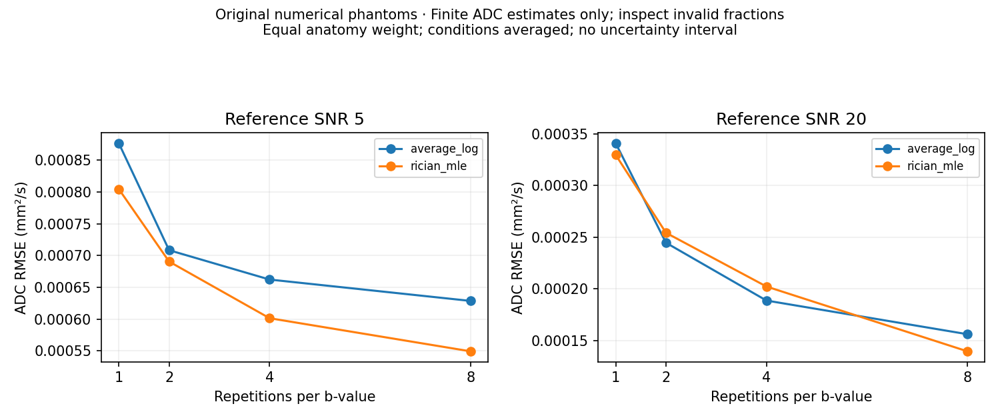
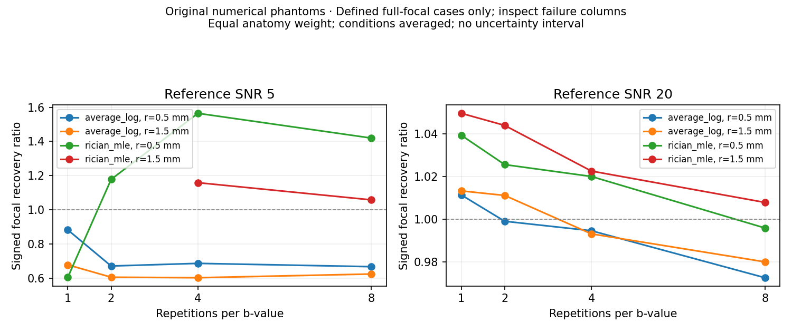
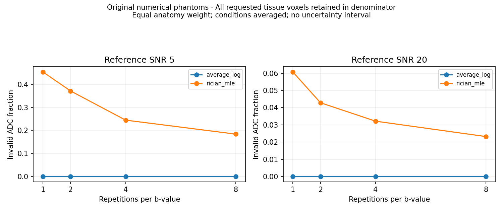

# CPU pilot: conventional ADC fidelity

Executed and reviewed 2026-10-02. This is a reproducible numerical pilot, not a clinical or anatomical validation study.

## Experiment and reproducibility

The executable [configuration](../configs/pilot.json) assigns six original toy geometries to train/validation/calibration/test counts 1/1/2/2. Only the two test geometries are evaluated. No model is trained or calibrated. Each geometry has two focal radii, two signed ADC contrasts, two SNRs, two noise realizations, four per-b repetition budgets, and two methods: **256 method-case rows per noise-pairing run**. The common-noise and independent-noise runs together contain 512 rows, representing only two independent geometry groups.

Fine tissue ADC/S0 are synthetic numerical parameters. References are fitted from noiseless, block-averaged signals. Tissue and focal masks include every intersecting coarse footprint, including partial-volume borders. Known sigma is supplied to the Rician comparator. See the [scientific specification](BENCHMARK_SPEC.md) for units, geometry, reference and invalid-fit policies.

With the locked environment installed, reproduce the default common-noise run:

```sh
python -m adc_fidelity_bench benchmark --config configs/pilot.json --output outputs/pilot
```

Then generate the sensitivity configuration and run it in a fresh directory:

```sh
python - <<'PY'
import json
from pathlib import Path
config = json.loads(Path('configs/pilot.json').read_text())
config['paired_noise'] = 'independent'
Path('outputs/pilot-independent-config.json').write_text(json.dumps(config, indent=2) + '\n')
PY
python -m adc_fidelity_bench benchmark --config outputs/pilot-independent-config.json --output outputs/pilot-independent
```

Each result directory contains configurations, seeds/splits, source hashes, software versions, per-case/regional metrics and failure counts, anatomy-level summaries, cohort summaries, plots, and one illustrative array archive. Existing directories are preserved. The example archive corresponds to the first row of `cases.csv`; its assigned fine-resolution ADC/S0 and noiseless coarse references are distinct arrays.

Numerical verification used Python 3.13.7, NumPy 2.4.3, SciPy 1.17.1 and Matplotlib 3.10.9. **164 tests passed** both against source and an installed wheel in an isolated environment. The installed CLI smoke also passed. Independent specification and code reviews found and resolved unbounded/null Rician fits, complex-resampling loss, and an invalid derived-noise configuration. CI checks Python 3.11/3.13 separately; local Python 3.11 execution was not performed.

## Common-noise results

Noise realizations are averaged within each anatomy/condition, then conditions within anatomy, then anatomies equally for this compact table. RMSE is conditional on finite ADC estimates. Recovery is conditional on fully valid paired focal regions, with defined-case counts shown explicitly. These descriptive means have no uncertainty intervals. Each listed method/SNR/budget has 16 cases.

| Reference SNR | Method | Repetitions per b | ADC RMSE (10⁻³ mm²/s) | Focal recovery ratio | Invalid ADC | Defined focal cases |
| --- | --- | ---: | ---: | ---: | ---: | ---: |
| 5 | Magnitude average + log fit | 1 | 0.876 | 0.780 | 0.0% | 16/16 |
| 5 | Magnitude average + log fit | 8 | 0.629 | 0.645 | 0.0% | 16/16 |
| 5 | Known-sigma Rician MLE | 1 | 0.804 | 0.604 | 45.4% | 2/16 |
| 5 | Known-sigma Rician MLE | 8 | 0.549 | 1.309 | 18.4% | 12/16 |
| 20 | Magnitude average + log fit | 1 | 0.341 | 1.012 | 0.0% | 16/16 |
| 20 | Magnitude average + log fit | 8 | 0.156 | 0.976 | 0.0% | 16/16 |
| 20 | Known-sigma Rician MLE | 1 | 0.330 | 1.045 | 6.1% | 16/16 |
| 20 | Known-sigma Rician MLE | 8 | 0.140 | 1.002 | 2.3% | 16/16 |

At SNR 5, averaging reduced RMSE as repetitions increased while retaining negative bias: the eight-repeat mean bias was −0.000490 mm²/s and mean focal recovery was 0.645 in this controlled pairing. More repetitions alone did not remove magnitude-noise bias in this pilot.

The Rician comparator has substantial unidentified ADC at low SNR, especially in low-amplitude partial-volume borders. Its finite-estimate RMSE excludes those voxels. Its SNR-5 eight-repeat focal ratio of 1.309 includes 12 of 16 cases; the other four have incomplete focal pairs. These changing denominators preclude an unconditional method ranking from the error curve.







## Independent-noise sensitivity

The following eight-repeat results use independent healthy/perturbed noise. They have the same parameter grid and anatomy assignments. Shared noise lowers paired-change variance; this small sensitivity experiment exposes why its focal ratios cannot be interpreted as measured longitudinal repeatability.

| Reference SNR | Method | ADC RMSE (10⁻³ mm²/s) | Focal recovery ratio | Invalid ADC | Defined focal cases | Non-focal change RMSE (10⁻³ mm²/s) |
| --- | --- | ---: | ---: | ---: | ---: | ---: |
| 5 | Magnitude average + log fit | 0.646 | 0.049 | 0.0% | 16/16 | 0.283 |
| 5 | Known-sigma Rician MLE | 0.541 | 0.747 | 15.2% | 13/16 | 0.750 |
| 20 | Magnitude average + log fit | 0.151 | 0.825 | 0.0% | 16/16 | 0.169 |
| 20 | Known-sigma Rician MLE | 0.209 | 0.848 | 2.0% | 16/16 | 0.271 |

The unstable focal means reflect the small pilot and noise-pairing sensitivity. Outside the focal footprints, common-noise paired change is exactly zero for these voxelwise methods because their inputs are identical. That is an experimental coupling property, not evidence of spatial denoising. Independent-noise non-focal change measures paired estimation error; future spatial methods need explicit spillover analysis as well.

## Supported conclusions and next work

The implementation correctly exposes bias, signed focal recovery, partial-volume references, and numerical/identifiability failures under its declared toy signal/noise model. The pilot does not determine how many acquisitions are sufficient. It has no learned estimator, published denoising comparison, unfamiliar-regime study, calibrated error bound, or stopping policy. Two toy geometry groups cannot establish population uncertainty or anatomical generalization.

Next implement the [uncertainty and stopping protocol](EVALUATION.md), expand independent anatomy/regime coverage, and compare compatible published denoisers before a small learned method. Patient work still requires approved access and disjoint input/reference repetitions. No clinical acceptance threshold, prospective scanner-time saving, or biological interpretation follows from these results.
